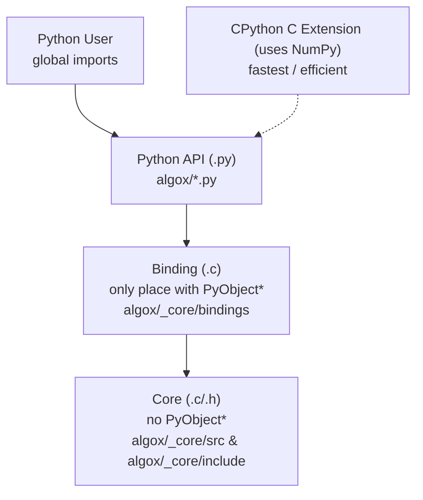

.c vs .h
--------

* .h -> declarations (what exists)
* .c -> implementations (how it works)


#### C backend - Python Wrapper



 ``` 90% - C; 10% - CPython ```

#### Things to learn in C

* malloc - 
* free - 
* typedef - Creates an alias (nickname) for a type.

without typedef 
---------------

```c
struct Vector {
    int size;
};

struct Vector v;
```
with typedef
------------

```c
typedef struct Vector {
    int size;
} Vector;

Vector V;
```

* struct - A struct groups multiple values into a single type.

Usage:
=====

```c
struct Vector {
    int size;
    int capacity;
};

Vector V;
V.size = 10;
V.capacity = 20;
```

* void * - 

**compiling with include for testing (run from : _core/)**
```bash
clang -Iinclude src/containers/linked_list.c -o linked_list
```